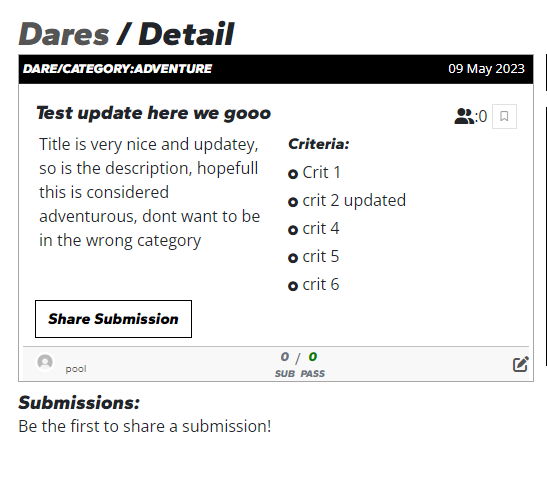

# DARE/SHARE

This project is built as part of the Code Institute Full Stack Software Development coures. The DARE/SHARE application is a social platform where users can dare the entire community, with everyone able to participate in creating, doing and reviewing the dares. The dares can vary and will be decided by the community, be it for fun and virality or to improve the world, it's up to the users!

# Deployed project

[Click to go to Website](https://challengeshare.herokuapp.com/)

## Repository

[Find the project repository here.](https://github.com/FRNBDN/challengeshare-frontend)

# General introduction and instructions

## Project Approach

This application is built using an agile approach, the functionalities were broken down into Epics & User stories, the user stories were split into 5 epics, but turned to be 4, as one was scrapped completely, more on that later.

## Epics & Milestones

The application features were broken down into User stories and added together into epics.
Each isse is a user story, each milestone is an epic

[All Epics can be viewed here.](https://github.com/FRNBDN/challengeshare-frontend/milestones)
The following Epics were defined:

- Navigation & authentication - all stories related to account management and navigaton
- Challenges - All stories related to all pages in the challenge group, so challengefeedpage, challengepage etc.
- Profile Page - All stories related to displaying user profiles, and info.
- Submissions & Reviews - all stories related to creating, displaying submissions, having reviews as a part of this due to them only being displayed on submission pages.
- Landing Page - All stories related to the landing page, but it was scrapped since it was more like a layer of abstraction, than enticement.

## Project Planning

The project was planned out using User Stories in github Issues and Project Board.

# User stories

All the user stories are on in the issues,

[Grouped in Milestones](https://github.com/FRNBDN/challengeshare-frontend/milestones)

[Issues List](https://github.com/FRNBDN/challengeshare-frontend/issues?q=is%3Aissue+is%3Aclosed)

[On the finished board](https://github.com/users/FRNBDN/projects/6/views/1)

The total number of issues created are: 38

The format of the issues are:

**Title**

As a **user** I can **action** so that I can **expected outcome**

# Features

This application has several features which I will highlight per page.

- Prior to pages lets begin with the navbar, and what you can do on there:

  - Sign In
  - Sign Up
  - Sign Out, if logged in
  - Return to home(submissionfeed)
  - View your own profile, if logged in.
  - Navigate to Daresfeed
  - Navigate to Submissionsfeed
  - Create new dare, if logged in

- On the submissionfeed users may:

  - Browse Submissions
  - Navigate to each dare page of every submission on the submissionsfeed
  - Navigate to submissionpage of every submission on the submissionsfeed
  - Review submissions, if logged in, not owner, not already reviewd it
  - Navigate to submission owners profiles
  - Navigate to daresfeed
  - filter the submissions, if logged in, by followed users, own submissions
  - Search for submissions based on username, text
  - Create new dare, if logged in
  - Edit their owned submission, if logged in, owner

- On the SubmissionPage users may:

  - View one submissions details, all of which are on the submissionsfeed
  - Navigate to the darepage of the submission
  - Navigate to users profiles, submission owner, review owners
  - Review submissions, if logged in, not owner, not already reviewd it
  - View other peoples reviews of the submission
  - Navigate back to submissionfeed
  - Create new dare, if logged in
  - Edit/delete their owned submission, if logged in, owner, via the editpage
  - Edit/delete their own review, if logged in, owner

- On the daresfeed users may:

  - Browse dares
  - Bookmark Dares
  - Navigate to darepage of every dare on the darefeed
  - Share a submissions, if logged in, not owner, not already submitted
  - Navigate to dare owners profiles
  - Navigate to submissionsfeed
  - filter the dares, if logged in, by followed users, bookmarked, not submitted
  - Search for dares based on username, description, category and title
  - Create new dare, if logged in
  - Edit/delete their owned dare, if logged in, owner, via the editpage

- On the DarePage users may:

  - View one dare details, all of which are on the daresfeed
  - Bookmark Dare
  - Navigate to submissionpage of submissions to the dare
  - Share a submissions, if logged in, not owner, not already submitted
  - Navigate to dare owners profiles
  - Navigate to daresfeed
  - Navigate to Create new dare form, if logged in
  - Edit/delete their owned dare, if logged in, owner, via the editpage

- On the ProfilePage users may:

  - See the username, bio, picture of the user profile, as well as the user stats: followers, following, dare points, sub points
  - Edit their profile bio/picture/username/password through the editprofilepage, if owner of page
  - see all the dares by the user
  - see all the submissions by the user
  - see all the followers the user has
  - see all the users the user follows

- Features of forms:

  - Edit/Create Posts let you add title, category and up to 5 criteria
  - Edit/Create Submission lets you add text and upload up to 5 image files
  - Edit/Create review lets you add text, set your vote for the submission to pass or not

- Universal component

  - Top Profiles is shown on most pages throughout the application, with profiles filtered by followers.

## Future Features

The following features would be nice to add in the future:

- Top Profiles component being filtered by a metric taking into account recency, dare/sub points etc.
- More advanced filtering, being able to filter on all the end points and ascending, descending
- An algorithm that bumps the dares/subs a bit in the feed if they are popular.
- A notification system for when users interact with your dares/submissions/reviews etc.

# Design & wireframing

## Colourscheme

The plan with DARE/SHARE was initially to infuse lots of colors and be youthful, but it got stale and tacky very quickly. So I decided to go with very basic colors in black and white and gray scale, with very sparing use of colors. I didnt choose any specific grays or whites but rather naturally landed on them as I was styling.

The colors I used were named colors such as green, red and orange, they are for the status of the submissions, so pass, fail, pending. The red is also used delete hoves and clicks and the red and green used on the button for review submit depending on the vote, if it is a pass or fail.

## WireFrames

The wireframes for this project was made with Balsamiq, and I believe it had some effect in how I wanted to style my project, as it was a good inspiration for a youthful design!

The wireframes were used as a rough sketch of what the application was meant to do and look like. Some features are not present, added or redesigned between the creation of the wireframes and the submission of the project.

## Typography

- The Brand font which is used very liberally within the project is 'Gantari', sans-serif. Other than that the regular text font is open sans, a neutral one to go with the very bold brandfont.

## Icons

- All icons used on the website are from FontAwesome, even the 'logo' that the app has is from there!

## Imagery

- As mentioned, the idea was to go for a youthful and bold look so there is a lot of thick borders, bold font and strong design on the website, with the colors being black and white, it lends itself to the imagery aswell, with it making it look a bit like a cartoon.

# Data model

The data model used for this project is implemented in challengeshare-api.
Please refer to the ReadMe of the API for the data model.
[challengeshare API link](https://github.com/FRNBDN/challengeshare-api/blob/main/README.md)

# Technology used

## Languages used

- [HTML5](https://en.wikipedia.org/wiki/HTML5)
- [CSS](https://en.wikipedia.org/wiki/CSS)
- [ReactJS](https://en.wikipedia.org/wiki/CSS)
- [JavaScript](https://en.wikipedia.org/wiki/JavaScript)

## Frameworks & Libraries used

- [React Bootstrap 4](https://react-bootstrap.github.io/)

  - I used React bootstrap throughout the site to make it responsive. I sourced code from the Bootstrap documentation when building the Navbar, Cards, Badges, Containers and Buttons.

- [Google Fonts](https://fonts.google.com/)
  - Fonts are imported from google fonts.
- [Font awesome](https://fontawesome.com/)

  - I used icons from font awesome for easy to understand iconografy where space was at a premium

# Testing

## Validators

### Lighthouse

Lighthouse Results give me near perfect score on seo and best practices, but accessibility and performance is lacking, especially on the heaviest pages with the images tanking the performance the most, like submissions. The submissions page tested is the feed, and it is loading in essentially all models, images and the review create form, definately the heaviest of them all.

Mobile Submissions

Desktop Submissions

Mobile Dare

Desktop Dare

Mobile Profile

Desktop Profile

### W3C CSS Validation

The style.css code has been validated by the W3C CSS validator and passed without errors from bootstrap, and also a final one by me, which was fixed

## Manual Testing

### Manual Test Case - Dare CRUD

Creating dare:

After inputting the data and hitting create this is the result, meaning it works!

Now editing dare, by pressing the small edit button on the bottom right:

And after saving, remember the delete button in the bottom right of the edit page:

The edit is successful, chaning the title, text and updating/deleting and adding new criteria , now for the dares page after the delete being pressed in the edit page.

Successful test of CRUD functionality on the dare model.

### Manual Test Case - Submission CRUD

Creating Submission: After inputting the data and hitting create this is the result, meaning it works!

SubmissionPage view after crating the submission

Edit page, same as create page but has a delete button, essentially.

Edit successful, text changed , image delete and upload

View of DarePage after deleting the submisison

Successful test of CRUD functionality on the submission model.

### Manual Test Case - Review CRUD

Filling in the review form but not having checked all checkboxes...

... Filled in all check boxes

Confirm creation of review

Editing review vote_pass and review text:

Confirm changes to review

Confirm delete after pressing x in top right

All CRUD functionality passed!

### Manual Test Case - Profile CRU(no D)

First of all the account has already been created, so thats the C out of the way,

lets move to viewing the profile before anything

Then lets go to the top right of the box, the cog, which brigns us to the edit page.

the username being updated in the picture above.

The bio is now being updated on the picutre above

As you can see on the final pciture here, everything works,

You will also just have to take my word for the fact that passwordchanges work!

### Manual Test Case - Follow Functionality

Pretty simple, ill let the pictures do the work here, i follow profiles on the right, and the left stats show my follower count changing accordingly.

## Automated testing

I did not manage to get automated testing to work, I kept running in to erros that the tutors wouldnt be able to solve either.

## Bugs found and solved

Throughout the project there were multiple small bugs found that were dealt with without any issue and the major ones that I couldnt fix are still unsolved!

### Unsolved bugs

#### Unable to sign out

I dont know how to solve this bug as the interceptors and the handle signout functions doesnt produce any errors, and there seems to be no clues as to why this isnt working, I checked the differences of the backend and frontend for the auth code and I cannot for the life of me find the problem. it seems to be an issue with the combination of the front and back end because the backend can handle signouts just fine on its own in development, but when its prod and talking to frontend, it crashes, but Im not sure if it is the front or backend that is the issue.

#### Unable to run Automated Tests

Same as the above in that I have found nothing that is cause for concern in differences between my code and the walkthrough code but for some reason mine doesnt work.

[This](https://stackoverflow.com/questions/39830580/jest-test-fails-typeerror-window-matchmedia-is-not-a-function) post has an official workaround for the issue I have but it doesnt solve it for me, since I get more issues coming after, and they seem to have no answer. The code insitute tutors are not able to help me either.

# Deployment

## Heroku

The project was deployed to Heroku using the following steps:

1. I pushed my final code via the terminal after finishing the project.
2. I created a new Heroku app
3. I linked the Heroku app to the repository
4. I pushed my final code via the terminal after finishing the project.
5. Then I selected 'deploy'

## Creating a local clone

You can create a local clone of the repository via the following steps:

1. navigate to the main page of the repository
2. download the code
3. Copy the URL for the repository.
4. Open Terminal
5. Change the current working directory to the location where you want the cloned directory.
6. Type git clone, and then paste the URL you copied earlier.
7. Press Enter to create your local clone.

For more detailed instructions, navigate to the following page:
https://docs.github.com/en/repositories/creating-and-managing-repositories/cloning-a-repository

# Credits

## Code

### Code Institute:

- The project is based off of the Code Institute Moments walkthrough project. With changes to accomodate the changes made in the API and scope of the project.

### Bootstrap:

- I have used Bootstrap classes throughout my project, including for layout utilities and cards. I sourced code from the Bootstrap documentation when building the Navbar, Cards, Dropdown, and pagination.

### Favicon

Favicon was made by me using (https://pixlr.com/)[Pixlr] and the windows snipping tool on my Nav Logo.
